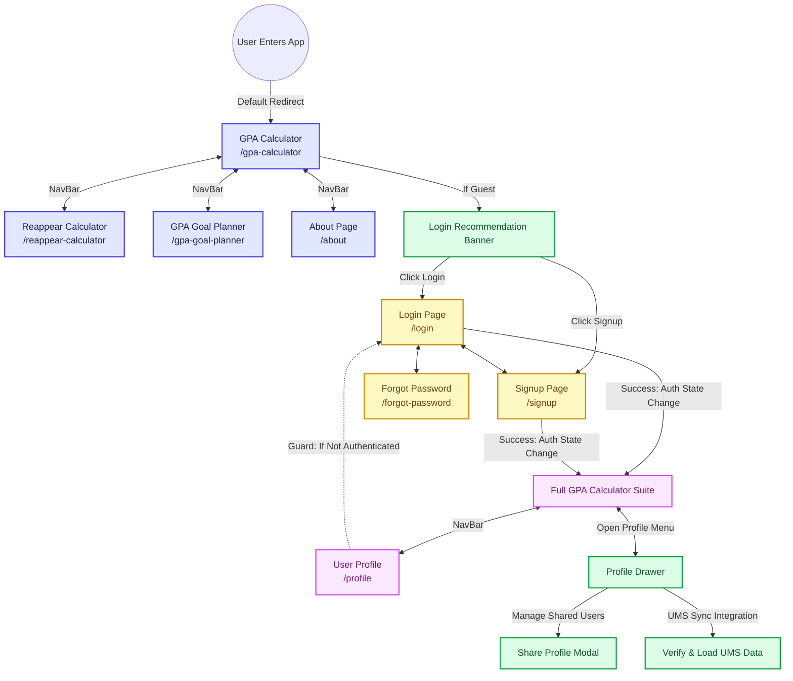
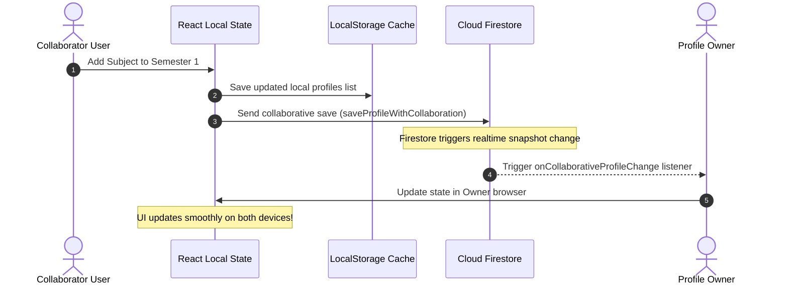

# 🎓 Bhemu Calculator - Web Flow Documentation

This document describes the comprehensive web architecture, routing paths, navigation flows, and data synchronization patterns of **Bhemu Calculator**. It is intended to serve as the single source of truth for understanding how a user interacts with the app, how states transition between guests and authenticated users, and how Firebase synchronizes collaborative edits.

---

## 🗺️ Architectural Overview & User Journeys

Bhemu Calculator provides a fluid React-based interface with a dynamic layout that shifts dynamically based on a user's authentication state. Below are the two primary user paths:

### 👤 Guest / Unauthenticated Journey
1. **Landing & Initialization**: The guest lands on the `/` route, which immediately redirects them to `/gpa-calculator`.
2. **Access Limitation**: Guests can interact with stateless calculators:
   * **Reappear Calculator** (`/reappear-calculator`)
   * **GPA Goal Planner** (`/gpa-goal-planner`)
   * **About Page** (`/about`)
3. **Workspace Gate**: When visiting the **GPA Calculator**, guests are shown a `LoginRecommendation` screen detailing features like multi-semester tracking, cloud-sync, and real-time sharing. They must log in or sign up to unlock active profiles.
4. **Auth Flow**: The guest can seamlessly navigate to `/login`, `/signup`, or `/forgot-password` to establish a persistent session.

### 🔐 Authenticated User Journey
1. **Automatic Sync**: Upon login via **Firebase Auth** (Email/Password or Google OAuth), the user's active session is established.
2. **Profile Provisioning**: If a user is new, a default GPA profile named `<DisplayName> (Default)` is initialized in Firestore under their UID.
3. **GPA Management**: The user is granted full access to `/gpa-calculator` to create multiple academic profiles, manage semesters, list subjects, input grades, and calculate SGPA & CGPA in real-time.
4. **Collaboration & Sharing**:
   * Users can share any of their profiles with classmates via email.
   * Users can set permissions to either **Read-Only** or **Edit**.
   * Users can view profiles shared *with them* or *by them* from an interactive **Profile Drawer**.
5. **Protected Profile Panel**: The `/profile` route is accessible, allowing users to update their avatars, change display names, and manage account credentials or deletion.

---

## 📊 Complete Interactive Page Flow

The flowchart below visualizes all user actions, navigation states, and page access controls.



---

## 🧭 Page-by-Page Specifications & Action Flows

### 1. GPA Calculator (`/gpa-calculator`)
* **Role**: Primary workspace & Dashboard.
* **Layout Structure**:
  * **Header**: Dynamic typography detailing GPA calculations.
  * **Profile Selection Selector**: Clickable card to toggle academic profiles via the **Profile Drawer**.
  * **CGPA & Overview Panel**: Circular gradient visualization of cumulative GPA, number of semesters, total subjects, and aggregated academic credits.
  * **Semester Tabs**: Horizontal scrollbar displaying SGPAs. Each tab houses a delete button (`XMarkIcon`) that triggers a confirmation modal.
  * **Subject Input Form**: Forms for subject name, grade points, and credits with dynamic type conversion.
  * **Subject List Table**: Modular list showing subjects with edit/delete hooks.
* **Access Rules**: Fully public layout shell, but redirects guest workspace state to the Login Recommendation banner.

---

### 2. Reappear & Backlog Calculator (`/reappear-calculator`)
* **Role**: Static tool to calculate exam requirements to clear backlogs or raise current CGPAs.
* **Layout Structure**:
  * Input forms for current SGPA/CGPA, credit values, target grades, and individual backlog subjects.
  * Interactive outputs detailing the minimum internal and external grades required in future evaluations to hit the targets.
* **Access Rules**: Fully public route. Session persistence is independent of the user's login state.

---

### 3. GPA Goal Planner (`/gpa-goal-planner`)
* **Role**: Dynamic academic projector.
* **Layout Structure**:
  * **Sliders / Inputs**: Quick options for Total Course Duration (4, 6, or 8 Semesters), completed semesters, current CGPA, and target CGPA.
  * **Result Panel**: Evaluates if the goal is mathematically reachable.
  * **Visual Warnings**: 
    * 🟢 **Target Achievable (GPA $\le$ 9.0)**: Shows a green success banner.
    * 🟡 **Target Achievable (9.0 < GPA $\le$ 10.0)**: Shows a yellow warning banner urging extreme focus.
    * 🔴 **Target Unreachable (GPA > 10.0)**: Shows a red alert informing the user that the target exceeds the grade point ceiling.
* **Access Rules**: Fully public route.

---

### 4. User Profile Management (`/profile` - Protected)
* **Role**: Private credential and account customizer.
* **Layout Structure**:
  * Personal information form (Display Name, Academic Program, Custom Avatars).
  * Security management (Password Change options, Firebase Google Link statuses).
  * Danger Zone: Permanent account deletion utilities.
* **Access Rules**: Wrapped in a `<PrivateRoute>` guard. Attempts by guests to access this path cache their original location state and redirect them to `/login`. Upon successful sign-in, the router redirects them back to `/profile`.

---

### 5. Authentication Gateways (`/login`, `/signup`, `/forgot-password`)
* **Role**: Identity resolution.
* **Layout Structure**:
  * Glassmorphic login cards supporting Email/Password verification and Google OAuth identity tokens.
* **Access Rules**: Public routes. If the user is already authenticated, the Auth Context triggers redirection to `/gpa-calculator`.

---

## 🔄 Data Sync & Real-time Collaboration Architecture

Bhemu Calculator uses **Firebase Firestore** combined with local memory caching to ensure instantaneous interaction alongside reliable cloud durability.



### 📡 State Persistence Hierarchy

1. **Local State (`React.useState`)**: Handles high-frequency events (input typing, menu clicks, active semester switches) for 0ms visual latency.
2. **Browser Storage (`localStorage`)**:
   * Caches the most recent active profile ID (`activeGpaProfile`).
   * Caches offline profile snapshots (`gpaProfiles`) to avoid flash-of-unstyled-content (FOUC) while Firebase establishes its network session.
3. **Database (`Cloud Firestore`)**:
   * Acts as the ultimate source of truth for authenticated users.
   * Leverages `onSnapshot` inside `useGpaData` to sync academic changes seamlessly across active browser windows.

> [!NOTE]
> The custom `useGpaData` hook implements a strict millisecond timestamp check (`lastModified`) inside the subscription callback. This guards against infinite re-render loops when multiple users are reading/writing to the same shared profile document simultaneously.

---

## 🤝 Sharing & Collaboration Flow

Sharing academic profiles is designed around explicit user authorization. The sharing flow behaves as follows:

```
[Owner Account]
      │
      ├───► Generates Share Link or invites [Collaborator Email]
      │
      ├───► Sets Permission Status:
      │         ├───► "read": Grant Read-Only rights (Cannot edit subjects or semesters)
      │         └───► "edit": Grant Collaborative Editing rights
      │
      └─► [Collaborator Account]
                │
                ├───► Profile appears inside "Shared with Me" in Profile Drawer
                └───► Option to "Copy to My Account" (Clones data into independent profile)
```

1. **Initiation**: The profile owner clicks the **Share Button** on an active profile.
2. **Access Assignment**: The owner inputs the collaborator's email and chooses between **Read Only** or **Edit Access**.
3. **Permission Handlers**:
   * **Read-Only**: The collaborator can review subject grades, credits, and aggregates. All mutate hooks (add semester, add subject, edit subject, delete) are dynamically disabled in the UI.
   * **Edit Access**: The collaborator has live write permissions. Writes bypass standard profiles pathways and trigger collaborative mutations that update the owner's Firestore collection.
4. **Independent Copying**: Collaborators can click **Copy to My Account** to clone the shared profile. This cuts the active link, duplicating the entire semester structure into a private profile under the collaborator's sole control.
